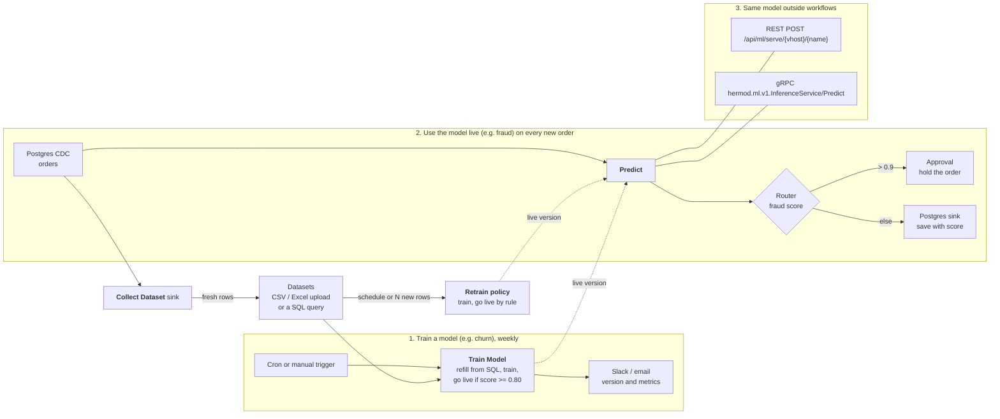

# Machine learning

Hermod trains machine-learning models on your data and calls them from
workflows and other applications. A model belongs to one vhost and is used
three ways: the **Predict** node in a workflow, the REST API, and gRPC.

A model is either **trained in Hermod**, on a dataset, by the `hermod-ml`
worker; or **served elsewhere** (KServe, Triton, MLServer, MLflow) and
registered by its address. Both are called the same way. A running workflow
keeps a dataset growing with the **Collect Dataset** sink, and a trained model
can retrain by itself on a schedule or once enough new rows have arrived.

It also prepares the features a model takes: the *Feature Engineering* nodes
scale, encode and bucketize fields, and compute rolling features and anomaly
scores per key (see [Feature engineering nodes](#feature-engineering-nodes)).



## Train a model

Training runs in **hermod-ml**, a Python worker beside Hermod (scikit-learn,
XGBoost, and in the `-dl` image PyTorch and Keras; every model is exported to
ONNX and served with ONNX Runtime; it never loads a pickle). Run it and point
Hermod at it:

| Setting | On | Meaning |
|---|---|---|
| `HERMOD_ML_WORKER_URL` | Hermod | The worker's address, e.g. `http://hermod-ml:8090`. Unset means training is off. |
| `HERMOD_ML_WORKER_TOKEN` | Hermod | Sent as a bearer token; must equal the worker's `HERMOD_ML_TOKEN`. |
| `HERMOD_ML_TRAIN_TIMEOUT` | Hermod | How long one training may take, default `30m`. |
| `HERMOD_ML_TOKEN` | worker | Required token. Without it the worker is open: never run it so outside a private network. |
| `HERMOD_ML_DATA_DIR` | worker | Datasets and model versions, default `/var/lib/hermod-ml`. Keep it on a volume. |
| `HERMOD_ML_MAX_TRAININGS` | worker | Trainings at once, default 1; another gets "busy". |

With Helm: `--set mlWorker.enabled=true --set mlWorker.token=…` (or
`mlWorker.existingSecret`). The chart refuses to run the worker without a token.

```bash
docker run -d --name hermod-ml -p 8090:8090 -e HERMOD_ML_TOKEN=change-me \
  -v hermod-ml:/var/lib/hermod-ml ghcr.io/gsoultan/hermod-ml:latest
```

### Image variants

| Image | Tags | Adds | Platforms |
|---|---|---|---|
| `hermod-ml` | `X.Y.Z`, `X.Y`, `latest` | scikit-learn, XGBoost | linux/amd64, linux/arm64 |
| `hermod-ml` deep learning | `X.Y.Z-dl`, `X.Y-dl`, `latest-dl` | CPU-only PyTorch 2.9 and TensorFlow 2.20 with Keras 3 (`pytorch_mlp`, `keras_mlp`) | linux/amd64 |

The `-dl` image is the same worker with `requirements-dl.txt` installed
(`docker build --build-arg HERMOD_ML_EXTRAS=dl ml/worker`). It is about 2 GB
larger (TensorFlow alone installs 1.2 GB) and is amd64 only: `tensorflow-cpu`
publishes no aarch64 wheels.
With Helm, choose it with `--set mlWorker.image.variant=dl` (the chart appends
`-dl` to its default tag; an explicit `mlWorker.image.tag` is used as given).

The slim image refuses `pytorch_mlp` and `keras_mlp` with a 400 that says they
are "not available in this image". The worker's `GET /v1/capabilities` lists
what it can train; Hermod passes the list on (`GET /api/ml/worker`), and the
Train dialog and the Train Model node offer only those algorithms.

**Resources.** The libraries load on the first deep-learning training and stay
loaded: PyTorch, TensorFlow and tf2onnx add about 650 MiB to the worker
(measured 274 MiB → 910 MiB resident, before any data). Raise
`mlWorker.resources.limits.memory` by at least 1Gi over what your datasets
need, and request a core or more of CPU: a network trains on CPU, for up to
`epochs` passes over the data. Training holds a worker slot
(`HERMOD_ML_MAX_TRAININGS`) until it finishes, and `HERMOD_ML_TRAIN_TIMEOUT`
still bounds it on Hermod's side.

### Datasets

On the **Models** page, under **Datasets**:

- **Upload a file**: CSV, or Excel `.xlsx` (first sheet, header row), up to 200 MB.
- **From a database**: a `SELECT` on one of the vhost's database sources
  (Postgres, MySQL/MariaDB, SQL Server, Oracle, SQLite, ClickHouse, DB2), run
  read-only with the source's own credentials, at most 1,000,000 rows unless you
  set another cap.

Filling a dataset again replaces its rows.

### Training

**Train a model** asks for a dataset, the column to predict, and optionally the
columns to learn from (empty means all the others). The task (classify, or
predict a number) is chosen from the target unless you pick it; the algorithm
is random forest unless you pick another:

| Algorithm | Library | Notes |
|---|---|---|
| `random_forest` (auto) | scikit-learn | 100 trees. |
| `gradient_boosting` | scikit-learn | |
| `linear` | scikit-learn | Logistic regression to classify, least squares for numbers; numbers are standardised. |
| `xgboost` | XGBoost | 200 trees, depth 6, `hist`. |
| `pytorch_mlp` | PyTorch | Multilayer perceptron; `-dl` image only. |
| `keras_mlp` | TensorFlow/Keras | The same network in Keras; `-dl` image only. |

Every algorithm reads the same inputs: numbers as they are (missing ones get
the training median), text one-hot encoded, and for `linear` and the two
networks, numbers standardised. The exported model takes one tensor per
feature and answers like any other, so a model can be retrained with another
algorithm without touching the workflows that call it.

The two networks (ReLU hidden layers, softmax or a linear output, Adam) hold a
tenth of the training rows back to stop early, and keep the weights that did
best on them. Under **Advanced** in the Train dialog, or the node's settings,
you can change:

| Parameter | Default | Range |
|---|---|---|
| Hidden layers | `64, 32` | 1 to 5 layers of 1 to 1024 units |
| Epochs | 200 | 1 to 1000 |
| Batch size | 32 | 1 to 4096 |
| Learning rate | 0.001 | above 0, at most 1 |
| Patience | 10 | epochs without a better validation loss before stopping, 1 to 1000 |

The seed is fixed (42 unless the API request sets `seed`), so the same data
and settings train the same model. Each version records the parameters it used
as `params`. Numbers are standardised before training and the target too for
regression; the exported graph does both, so predictions come back in the
target's units.

A fifth of the rows are held back to score the model:

- classification: `accuracy`, `f1` (macro), `roc_auc` (two classes); `score` is accuracy
- numbers: `rmse`, `mae`, `r2`; `score` is R²

Every training makes a new, immutable version. Whether it goes live is your
rule: **only when I put it live**, **always**, or **if it scores at least** a
minimum on a metric. A version that is not put live is kept; **Versions** on
the model lists them all and puts any one live, which is also how you roll back.

### Train Model node

*Machine Learning → Train Model* does the same from a workflow: each message
that reaches it trains a new version, and the message carries the result under
`training` (version, metrics, `live`, and why). Optionally it first refills the
dataset from a database source with a query, so a weekly cron workflow keeps
the model fresh. Put it in a workflow that runs on a schedule or on demand,
not one that sees every change to a table.

A trained model is called like any other: the Predict node sends a record's
fields, one per feature, and gets back `label` and `probability` for a
classifier, or `value` for a number.

### Collect Dataset sink

*ML Datasets → Collect Dataset* is a sink: every record it receives becomes a
row of a dataset of the workflow's vhost, appended on the worker. It never
replaces the dataset, and it writes only to its own vhost's datasets: a sink of
one vhost refuses records of a workflow in another.

| Setting | Meaning |
|---|---|
| `dataset` | Required. The dataset's name; a new name starts a new dataset. |
| `column_mappings` | Which fields become which columns, as the database sinks map them. Empty means the whole record, nested fields flattened to `parent_child` columns. |
| `mask_fields`, `mask_type` | Columns masked before the row leaves Hermod: `all` (`****`, the default), `partial`, `email` or `pii`, as the Mask node applies them. |
| `max_rows` | The dataset stops growing here, default 1,000,000. Later records are skipped and a warning is logged once. |

Rows go to the worker in batches, 500 at a time or every 5 seconds unless the
sink's reliability settings say otherwise; each append is one part file on the
worker. A failed append fails the batch, which is retried and then
dead-lettered like any other sink's, and a stopping workflow flushes what it
holds. Deleted records are not added.

### Retraining

**Retrain automatically** on a model trained in Hermod makes it train again by
itself:

- on a **schedule**, a cron expression such as `0 3 * * *` or `@daily`; and/or
- after **N new rows**: once its dataset holds N rows more than when the model
  last trained, by any means.

The policy holds the training (dataset, column to predict, features, task,
algorithm) and the go-live rule, as **Train a model** does. Hermod checks every
minute. A model is claimed in the database before it trains, so with several
Hermod servers each retraining runs once, and never while another training of
the same model, manual or not, is running (a manual training then gets 409).
The Models page shows the policy and the last retraining: the version it made
and whether it went live, or its error. A failed retraining is tried again
after 15 minutes; a worker that is busy is asked again on the next check.

Over the API: `PUT /api/vhosts/{vhost}/ml/models/{name}/retrain` with
`{"schedule","new_rows","spec":{"dataset","target","features","task","algorithm"},"go_live":{"mode","metric","min"}}`
sets it, `DELETE` on the same path clears it. The model's `retrain` and
`retrain_status` fields show both.

The spec is a whole training spec, so it can also name a `device` and a custom
script (`"algorithm": "custom:<name>"`): a retraining runs where a training by
hand would, on the GPU or custom-script pool, and is refused the same way when
that pool or custom scripts are off. A custom script retrains with its latest
version at the time. An unknown device, or `gpu` with a custom script, is
refused when the policy is saved.

## Custom training scripts

When the built-in algorithms are not enough, an Administrator can save a
Python script per vhost and train with it. A script is code that runs on your
infrastructure, so this is **off by default**, runs only on a worker pool of
its own, and that pool runs every script in a sandbox. Read
[Security](#security-of-custom-scripts) before you turn it on.

### The interface

A script defines two functions:

```python
def train(df, spec):
    """Return a fitted model, of any type."""

def export_onnx(model, spec):
    """Return that model as ONNX, as bytes."""
```

`df` is a pandas DataFrame of the training rows (the held-back fifth is not in
it): one column per feature, missing numbers already filled with the training
median, and the target column. `spec` is a dict:

| Key | Meaning |
|---|---|
| `task` | `"classification"` or `"regression"` |
| `target` | the target column's name |
| `features` | the feature columns, in order |
| `feature_types` | `{feature: "number" \| "string"}` |
| `labels` | classification only: the classes, in the order the probabilities must follow |
| `seed` | a random seed, for repeatable trainings |

The ONNX the script returns must be one Hermod can serve, and is checked
before it is kept:

- one input per feature, named after it, shaped `[n, 1]`: `float` for a number,
  `string` for a string. No other inputs.
- a classifier outputs the label (string or integer) and then a `float`
  probabilities tensor `[n, k]` with one column per entry of `spec["labels"]`,
  in that order. With skl2onnx, pass `options={id(clf): {"zipmap": False}}`.
- a regressor outputs one `float` value per row.
- no tensors stored in external files.

The model is then run in ONNX Runtime on the held-back rows, in a process of
its own, and scored exactly like a built-in one; the version records
`algorithm: "custom:<name>"`, and `script: {name, sha256}` saying which code
made it. Anything the script prints is kept, the last 16 KB of it, as the
version's `log`.

A script is chosen as the algorithm `custom:<name>`: in **Train a model**, on
the Train Model node, or in `POST …/train`. It is refused with a clear error if
it does not exist, if it fails, if it runs out of time or memory, or if its
ONNX does not match the rules above.

### Saving scripts

The **Scripts** tab of the Models page appears when the server has custom
scripts on. Scripts are stored per vhost in Hermod's database (SQL or MongoDB),
with every version kept: saving new source adds a version named by the SHA-256
of the source, and saving the same source again adds nothing. Deleting a script
deletes its versions; model versions it trained keep its name and hash.

| Route | Role |
|---|---|
| `GET /api/vhosts/{vhost}/ml/scripts` | any role: names, versions and hashes |
| `GET /api/vhosts/{vhost}/ml/scripts/{name}` | Editor: the latest source and every version |
| `PUT /api/vhosts/{vhost}/ml/scripts/{name}` `{"source": "…", "description": "…"}` | Administrator; audited with the version and SHA-256 |
| `DELETE /api/vhosts/{vhost}/ml/scripts/{name}` | Administrator; audited |

An Editor trains with a script. A script is at most 256 KB. Every one of these
routes answers 403 while custom scripts are off, and a training that names a
script answers 503 while the pool is not configured.

### Turning it on

| Setting | On | Meaning |
|---|---|---|
| `HERMOD_ML_CUSTOM_SCRIPTS` | Hermod | `true` turns custom scripts on. Default off. |
| `HERMOD_ML_CUSTOM_WORKER_URL` | Hermod | The custom-script pool. Trainings with a script go only here. |
| `HERMOD_ML_CUSTOM_WORKER_TOKEN` | Hermod | The pool's token. Must not be the main worker's. |
| `HERMOD_ML_CUSTOM_SCRIPTS` | pool | `true` lets the worker run scripts. It refuses to start without `HERMOD_ML_TOKEN`. |
| `HERMOD_ML_SANDBOX_CPU_SECONDS` | pool | CPU time a script may use, default 600. |
| `HERMOD_ML_SANDBOX_MEMORY_MB` | pool | Address space, default 2048 (at least 1024). |
| `HERMOD_ML_SANDBOX_TIMEOUT_SECONDS` | pool | Wall-clock limit, default 900. |
| `HERMOD_ML_SANDBOX_FILE_MB` | pool | Largest file a script may write, default 256. |
| `HERMOD_ML_SANDBOX_NPROC` | pool | Processes, default 512. |
| `HERMOD_ML_SANDBOX_OUTPUT_MB` | pool | Largest ONNX file, default 100. |
| `HERMOD_ML_SANDBOX_LOG_KB` | pool | Output kept from a run, default 64. |
| `HERMOD_ML_SANDBOX_THREADS` | pool | BLAS/OpenMP threads, default 1. |

With Helm, `mlWorker.customPool.enabled=true` and a `customPool.token` (or
`existingSecret`) deploy the pool and set all of the above:

```bash
helm upgrade hermod deploy/helm/hermod --set mlWorker.enabled=true --set mlWorker.token=… \
  --set mlWorker.customPool.enabled=true --set mlWorker.customPool.token=…
```

A training with a script runs like this: Hermod copies the dataset from the
main worker to the pool under a one-off name, the pool trains, Hermod copies
the new version back to the main worker (which checks it again and serves it),
and deletes the pool's copies. The pool keeps nothing between trainings.

### Security of custom scripts

A custom script is remote code execution by design: whoever can save one runs
Python on the pool. That is why saving one needs the Administrator role, why
the server flag is off by default, and why the pool is built to contain it:

- **Its own pool.** Scripts never run on the main worker, which holds every
  vhost's datasets and models. The pool holds only the one dataset of the
  training at hand (`maxTrainings` must be 1; the chart refuses otherwise),
  and its token is not the main worker's (the chart refuses the same token).
- **No network.** The chart gives the pool a NetworkPolicy that denies all
  egress, DNS included, and accepts ingress from Hermod's pods only; it
  refuses to render the pool without it. `customPool.networkPolicy.extraEgress`
  adds rules if a script must reach something. A NetworkPolicy needs a CNI
  that enforces it (Calico, Cilium, …); on one that does not, it does nothing.
- **A hardened pod.** Non-root (uid 10002 by default), read-only root
  filesystem, every capability dropped, no privilege escalation, seccomp
  `RuntimeDefault`, no service-account token, no service-link variables.
  Set `customPool.runtimeClassName` to run it under gVisor or Kata for a
  kernel boundary as well.
- **A sandboxed process.** Each script runs in a new Python process
  (`python -I`) in a session of its own, in a fresh temporary directory, with
  stdin closed and an environment of only `PATH`, `HOME`, `TMPDIR`, `LANG` and
  the thread settings: the worker's token is not in it. Limits are set with
  `setrlimit` before the script is imported: CPU seconds, address space, file
  size, process count, and no core dumps; a wall-clock timeout kills the whole
  process group. The worker marks itself non-dumpable, so a script cannot read
  the worker's memory or environment through `/proc`. Data goes in as a
  Parquet file and the model comes out as a file, read without following
  links; output and logs are capped.
- **Checked output.** The ONNX is checked against the spec and run in a
  separate, limited process before it is kept, and checked again when the main
  worker imports it.

What the sandbox does not do:

- The process limit (`nproc`) counts every process of the pool's user on the
  node, which is why the pool has a uid of its own. Set a pod PID limit on the
  kubelet (`podPidsLimit`) as well.
- A script can start a new session (`setsid`) for a child of its own, and that
  child is outside the process group the timeout kills. It keeps running as
  the pool's user, within the pod's CPU and memory limits, until the pod
  restarts, and it could read the dataset of a later training on the same
  pod. If the scripts' authors are not all equally trusted with every vhost's
  data, restart the pool's pods between trainings, or run one script author's
  trainings on a pool of their own.
- Setting `rlimit`s is not a kernel boundary. A kernel exploit escapes the
  process; only a sandboxed runtime class (gVisor, Kata) defends against that.
- The ONNX a script produces is served by the main worker's ONNX Runtime.
  It is checked and test-run in isolation first, but a graph that passes the
  checks on the held-back rows and still makes ONNX Runtime abort on other
  input would take the serving worker down with it. (ONNX Runtime 1.20, for
  example, aborts the whole process on a one-class tree ensemble; the check
  catches that one.) Kubernetes restarts the worker, but its predictions fail
  until it is back.

## GPU pools

Training a deep network (the `-dl` image) goes faster on a GPU. scikit-learn
and XGBoost as Hermod runs them train on the CPU either way, so a GPU only
helps the `-dl` image.

`mlWorker.gpuPool.enabled=true` deploys a second, training-only worker that
asks for `nvidia.com/gpu: 1`, tolerates the usual `nvidia.com/gpu` taint, and
takes `nodeSelector`, `tolerations`, `affinity` and an optional
`runtimeClassName` (for example `nvidia`). Give it the `-dl` image with
`gpuPool.image`, and its own token. Hermod reaches it through
`HERMOD_ML_GPU_WORKER_URL` and `HERMOD_ML_GPU_WORKER_TOKEN`.

A training asks for it with `"device": "gpu"`: the **Device** picker in Train a
model and on the Train Model node (shown only when a GPU pool is configured),
or `device` in `POST …/train`. It runs like a custom-script training: the
dataset is copied to the pool, the version is copied back to the main worker,
and **serving stays on the main worker**. `device` is `cpu` (the default) or
`gpu`; `gpu` is refused with 503 when no GPU pool is configured, and with 400
together with a custom script, which runs on the custom pool (give that pool a
GPU instead).

The main worker can itself run on GPU nodes: add `nvidia.com/gpu` to
`mlWorker.resources.limits` and set `mlWorker.nodeSelector`, `tolerations` and
`runtimeClassName`.

## Register a model served elsewhere

Open **Models** in the sidebar (Editor or Admin) and add a model:

| Field | Meaning |
|---|---|
| Name | How workflows and callers name it: letters, digits, `-`, `_`, `.` |
| Backend | `oip` for the Open Inference Protocol (KServe V2: KServe, Triton, Seldon MLServer, BentoML, TorchServe's V2 API) or `mlflow` for an MLflow scoring server (`/invocations`) |
| URL | The model server's base URL |
| Remote model / version | The model's name and version on that server (`oip` only) |
| Token secret | A vhost secret holding a bearer token for the server, if it needs one |
| Input name | Send every feature as one FP32 matrix tensor of this name (`oip` only). Empty sends one tensor per feature |
| Features | The features the model takes, in order. The Predict node offers a row for each |
| Timeout | Per call, default 30 s |

**Test** sends sample rows and shows the answer.

## Predict node

*Machine Learning → Predict.* Choose the model, map each feature to a record
field (or map nothing to send the whole record), and name the output field
(`prediction` by default). A model with one output writes the value; one with
several writes an object. A mapped field the record lacks fails the record
rather than sending a null; the node's On Error setting (fail, continue, drop)
decides what happens next.

## Feature engineering nodes

*Feature Engineering* in the palette holds the preprocessing a model needs
between the source and **Predict**. Each writes new fields, named after the
field it reads unless you name a target. A field may be a path or an expression; an
expression needs a target field. **Missing or unusable value** decides what
happens to a record without the field, or with text where a number is needed:
fail it (the default — the node's On Error setting then applies) or leave the
record unchanged.

The same preprocessing has to run at training and at inference, or the model
is served numbers on a different scale from the ones it learned. So **Scale**,
**Encode** and **Bucketize** never learn from the records they see: what they
apply is typed into the node once, from the training run, and every record is
transformed the same way.

### Scale

Min-max — `(v − min) / (max − min)` — or z-score — `(v − mean) / std` — per
field, with the statistics given in the node. Each field row takes its own
numbers, or leaves them blank to take them from **Fitted stats**, a JSON object
pasted from training:

```json
{"amount": {"mean": 120.5, "std": 40.2}, "age": {"min": 18, "max": 90}}
```

With no field rows, every field in the pasted stats is scaled. Output goes to
`<field>_scaled` unless a row names a target. **Clip** keeps min-max output in
[0, 1]; without it a value outside the training range scales past either end,
as it would have in training. A `max` not above `min`, or a `std` of 0,
fails every record with the reason, since it cannot scale anything.

### Encode

- **One-hot** — one 0/1 field per category in the list, named
  `<prefix><category>` (prefix `<field>_` by default), plus `<prefix>other` for
  a value not in the list. Turn the other bucket off to write all zeros
  instead.
- **Label** — a JSON mapping of category to integer, e.g. `{"S":0,"M":1,"L":2}`,
  written to `<field>_label`. An unknown category gets **Unknown value** (-1 by
  default), or fails the record.
- **Hash** — FNV-1a (32-bit) of the value, modulo **Buckets**, written to
  `<field>_bucket`. It needs no vocabulary and gives the same bucket on every
  run and version, so a model trained on it can be served by it.

A value is matched in its text form: the number `2` matches the category `"2"`.

### Bucketize

**Edges** e0, e1, …, en make n bins: [e0, e1), [e1, e2), …, [e(n−1), en]. Each
bin holds its lower edge; the last also holds en. With **Labels** (one per bin)
the label is written to `<field>_bin`, otherwise the bin's number from 0. A
value outside the edges writes null by default, or goes to the first or last
bin (**clip**), or fails the record.

### Rolling Features

Count, sum, mean, std (population), min and max of a field over each key's
recent records, written to `<prefix><feature>` — `amount_mean` with the default
prefix `<field>_`. **Key by** names the key, e.g. `customer_id`; without it there
is one window for every record. The window is either the last N records of the
key or the records of a time span (`5m`, `1h`) — at most **Max events per key**
of them, 1000 by default. The window includes the record being processed. Time
is processing time: when the record reached the node. Without a field the node
only counts records.

Memory is bounded: a node holds at most **Keys kept in memory** keys (10 000 by
default), dropping the key seen least recently, and each key holds at most its
window. Records of one key are applied one at a time, in the order they reach
the node, so parallel workers do not lose an update.

### Anomaly Score

Scores a field against the same kind of per-key window, then adds the record to
it:

- **Z-score** — `|v − mean| / std` of the window before the record. Default
  threshold 3.
- **IQR** — how many interquartile ranges `v` lies below Q1 or above Q3 (0
  between them). Quartiles interpolate linearly, as numpy's default does.
  Default threshold 1.5, Tukey's fences.

The score goes to `<field>_anomaly_score` and `score > threshold` to
`<field>_is_anomaly`. A key with less than **Minimum history** (10 by default,
or the window size if smaller) gets a null score and `false`. A history with no
spread — every value equal — scores an equal value 0 and flags any other with a
null score, since no finite score exists.

### What survives a restart

Rolling Features and Anomaly Score keep their windows the way Aggregate keeps
its totals:

- **By default** windows live in the worker's memory only. A restart, the
  workflow moving to another worker, or a key dropped from memory starts that
  key's window empty: its next records get features from less history.
- **Keep windows across restarts** also saves a key's window to the engine's
  state store after every record and reads it back when the key is next seen —
  after a restart, or after the key was dropped from memory. A time window read
  back drops what expired meanwhile. Failing to save does not fail the record;
  it is logged, and that key's saved window stays stale until the next save.

Either way, a record redelivered after a crash is counted again, and changing
the field or the window starts every key afresh.

## Serving to other applications

Serving is off until you make a serving key on the model (**Serving key →
Rotate**). The key is shown once; Hermod keeps only its SHA-256. Rotating
replaces it, and **Disable** removes it.

REST:

```bash
curl -X POST https://hermod.example.com/api/ml/serve/default/fraud \
  -H "X-API-Key: hml_…" \
  -d '{"instances": [{"amount": 912.5, "country": "ID"}]}'
# {"model":"fraud","predictions":[{"score":0.93}]}
```

`Authorization: Bearer hml_…` works too. A wrong key, a model without
serving, and a model that does not exist all answer the same 401.

gRPC (`pkg/ml/proto/inference.proto`), on Hermod's gRPC port with the key in
the `x-api-key` metadata:

```
hermod.ml.v1.InferenceService/Predict
  { vhost: "default", model: "fraud", instances: [{amount: 912.5, country: "ID"}] }
```

One call takes at most 1000 rows.

## Metrics

- `hermod_ml_predictions_total{vhost,model,outcome}`
- `hermod_ml_prediction_rows_total{vhost,model}`
- `hermod_ml_prediction_duration_seconds{vhost,model}`
