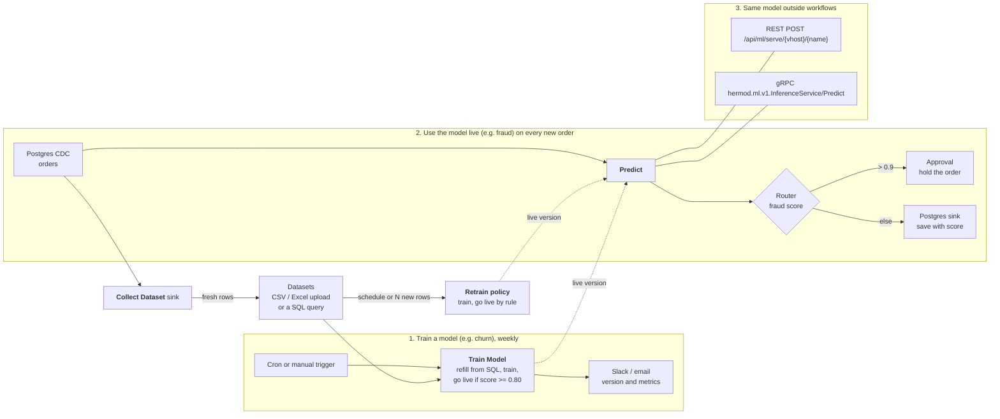

# Machine learning

Hermod trains machine-learning models on your data and calls them from
workflows and other applications. A model belongs to one vhost and is used
three ways: the **Predict** node in a workflow, the REST API, and gRPC.

A model is either **trained in Hermod**, on a dataset, by the `hermod-ml`
worker; or **served elsewhere** (KServe, Triton, MLServer, MLflow) and
registered by its address. Both are called the same way. A running workflow
keeps a dataset growing with the **Collect Dataset** sink, and a trained model
can retrain by itself on a schedule or once enough new rows have arrived.

It also prepares the features a model takes: the *Feature Engineering* nodes
scale, encode and bucketize fields, and compute rolling features and anomaly
scores per key (see [Feature engineering nodes](#feature-engineering-nodes)).



## Train a model

Training runs in **hermod-ml**, a Python worker beside Hermod (scikit-learn,
XGBoost, exported to ONNX and served with ONNX Runtime; it never loads a
pickle). Run it and point Hermod at it:

| Setting | On | Meaning |
|---|---|---|
| `HERMOD_ML_WORKER_URL` | Hermod | The worker's address, e.g. `http://hermod-ml:8090`. Unset means training is off. |
| `HERMOD_ML_WORKER_TOKEN` | Hermod | Sent as a bearer token; must equal the worker's `HERMOD_ML_TOKEN`. |
| `HERMOD_ML_TRAIN_TIMEOUT` | Hermod | How long one training may take, default `30m`. |
| `HERMOD_ML_TOKEN` | worker | Required token. Without it the worker is open: never run it so outside a private network. |
| `HERMOD_ML_DATA_DIR` | worker | Datasets and model versions, default `/var/lib/hermod-ml`. Keep it on a volume. |
| `HERMOD_ML_MAX_TRAININGS` | worker | Trainings at once, default 1; another gets "busy". |

With Helm: `--set mlWorker.enabled=true --set mlWorker.token=…` (or
`mlWorker.existingSecret`). The chart refuses to run the worker without a token.

```bash
docker run -d --name hermod-ml -p 8090:8090 -e HERMOD_ML_TOKEN=change-me \
  -v hermod-ml:/var/lib/hermod-ml ghcr.io/gsoultan/hermod-ml:latest
```

### Datasets

On the **Models** page, under **Datasets**:

- **Upload a file**: CSV, or Excel `.xlsx` (first sheet, header row), up to 200 MB.
- **From a database**: a `SELECT` on one of the vhost's database sources
  (Postgres, MySQL/MariaDB, SQL Server, Oracle, SQLite, ClickHouse, DB2), run
  read-only with the source's own credentials, at most 1,000,000 rows unless you
  set another cap.

Filling a dataset again replaces its rows.

### Training

**Train a model** asks for a dataset, the column to predict, and optionally the
columns to learn from (empty means all the others). The task (classify, or
predict a number) is chosen from the target unless you pick it; the algorithm
is random forest unless you pick gradient boosting, linear/logistic regression
or XGBoost. A fifth of the rows are held back to score the model:

- classification: `accuracy`, `f1` (macro), `roc_auc` (two classes); `score` is accuracy
- numbers: `rmse`, `mae`, `r2`; `score` is R²

Every training makes a new, immutable version. Whether it goes live is your
rule: **only when I put it live**, **always**, or **if it scores at least** a
minimum on a metric. A version that is not put live is kept; **Versions** on
the model lists them all and puts any one live, which is also how you roll back.

### Train Model node

*Machine Learning → Train Model* does the same from a workflow: each message
that reaches it trains a new version, and the message carries the result under
`training` (version, metrics, `live`, and why). Optionally it first refills the
dataset from a database source with a query, so a weekly cron workflow keeps
the model fresh. Put it in a workflow that runs on a schedule or on demand,
not one that sees every change to a table.

A trained model is called like any other: the Predict node sends a record's
fields, one per feature, and gets back `label` and `probability` for a
classifier, or `value` for a number.

### Collect Dataset sink

*ML Datasets → Collect Dataset* is a sink: every record it receives becomes a
row of a dataset of the workflow's vhost, appended on the worker. It never
replaces the dataset, and it writes only to its own vhost's datasets: a sink of
one vhost refuses records of a workflow in another.

| Setting | Meaning |
|---|---|
| `dataset` | Required. The dataset's name; a new name starts a new dataset. |
| `column_mappings` | Which fields become which columns, as the database sinks map them. Empty means the whole record, nested fields flattened to `parent_child` columns. |
| `mask_fields`, `mask_type` | Columns masked before the row leaves Hermod: `all` (`****`, the default), `partial`, `email` or `pii`, as the Mask node applies them. |
| `max_rows` | The dataset stops growing here, default 1,000,000. Later records are skipped and a warning is logged once. |

Rows go to the worker in batches, 500 at a time or every 5 seconds unless the
sink's reliability settings say otherwise; each append is one part file on the
worker. A failed append fails the batch, which is retried and then
dead-lettered like any other sink's, and a stopping workflow flushes what it
holds. Deleted records are not added.

### Retraining

**Retrain automatically** on a model trained in Hermod makes it train again by
itself:

- on a **schedule**, a cron expression such as `0 3 * * *` or `@daily`; and/or
- after **N new rows**: once its dataset holds N rows more than when the model
  last trained, by any means.

The policy holds the training (dataset, column to predict, features, task,
algorithm) and the go-live rule, as **Train a model** does. Hermod checks every
minute. A model is claimed in the database before it trains, so with several
Hermod servers each retraining runs once, and never while another training of
the same model, manual or not, is running (a manual training then gets 409).
The Models page shows the policy and the last retraining: the version it made
and whether it went live, or its error. A failed retraining is tried again
after 15 minutes; a worker that is busy is asked again on the next check.

Over the API: `PUT /api/vhosts/{vhost}/ml/models/{name}/retrain` with
`{"schedule","new_rows","spec":{"dataset","target","features","task","algorithm"},"go_live":{"mode","metric","min"}}`
sets it, `DELETE` on the same path clears it. The model's `retrain` and
`retrain_status` fields show both.

### In-process scoring

By default every prediction of a model trained in Hermod is an HTTP call to
the worker. **Scoring** on the Models page can set a trained model to
**in-process** instead: Hermod fetches the live version's ONNX graph from the
worker once and scores it itself, in pure Go (`pkg/ml/onnxscore`), with no
round trip.

It covers what the worker trains — linear, random forest, gradient boosting
and XGBoost models, for classification and regression. The graph may use only
these operators:

| Domain | Operators |
|---|---|
| `ai.onnx.ml` (opset 1–3) | `LinearClassifier`, `LinearRegressor`, `TreeEnsembleClassifier`, `TreeEnsembleRegressor`, `Scaler`, `Normalizer`, `OneHotEncoder`, `FeatureVectorizer` |
| `ai.onnx` (opset 1–23) | `Concat`, `Gather`, `Reshape`, `Cast`, `Identity`, `Softmax`, `ArgMax` |

The worker's exports use `Concat`, `Gather`, `Reshape` and `OneHotEncoder` to
lay out the features; `linear` adds `Scaler` and `LinearClassifier` (then
`Normalizer` for more than two classes) or `LinearRegressor`; the tree models
use `TreeEnsembleClassifier` or `TreeEnsembleRegressor`.

Nothing is guessed. A graph with any other operator, attribute or tensor
layout is refused when it loads, and the model keeps being scored by the
worker; so is a call whose rows hold a value the worker would read in a way
the scorer does not reproduce exactly (a feature missing from every row, or a
number given as text it would not parse the same). The status says which
version is scored in-process and its operators, or why it falls back. A new
live version is loaded on the next call. Each version's results match
onnxruntime to within 1e-5: the parity fixtures in
`pkg/ml/onnxscore/testdata` are produced by onnxruntime and regenerated with
`python -I pkg/ml/onnxscore/testdata/gen_fixtures.py` in the worker's
environment.

Measured with `go test -bench WorkerVsInProcess ./pkg/ml/onnxscore/` (a
worker on the same machine, reached over loopback, scoring the same version
both ways; 4-core Xeon at 2.1 GHz):

| Model | 1 row: worker | 1 row: in-process | 100 rows: worker | 100 rows: in-process |
|---|---|---|---|---|
| linear, binary | 1.85 ms | 5.6 µs | 2.47 ms | 82 µs |
| random forest, binary | 1.68 ms | 6.3 µs | 3.90 ms | 392 µs |
| gradient boosting, 3 classes | 2.36 ms | 12.3 µs | 4.59 ms | 685 µs |
| XGBoost, regression | 1.71 ms | 8.1 µs | 3.22 ms | 577 µs |

A worker over a real network adds its round trip to the worker column. Set
`HERMOD_ML_BENCH_WORKER_URL` (and `HERMOD_ML_BENCH_WORKER_TOKEN`) to run it;
`-bench InProcess` alone needs no worker.

Over the API: `GET /api/vhosts/{vhost}/ml/models/{name}/scoring` returns
`{"scoring","in_process","version","ops","reason"}`, and `PUT` on the same
path with `{"scoring":"worker"}` or `{"scoring":"in_process"}` (Editor) sets
it and answers with the new status. The model's `scoring` field holds the
setting. Only a model trained in Hermod can be scored in-process. The graph is
read from the worker's
`GET /v1/models/{vhost}/{name}/versions/{version}/model.onnx`.

## Register a model served elsewhere

Open **Models** in the sidebar (Editor or Admin) and add a model:

| Field | Meaning |
|---|---|
| Name | How workflows and callers name it: letters, digits, `-`, `_`, `.` |
| Backend | `oip` for the Open Inference Protocol (KServe V2: KServe, Triton, Seldon MLServer, BentoML, TorchServe's V2 API) or `mlflow` for an MLflow scoring server (`/invocations`) |
| URL | The model server's base URL |
| Remote model / version | The model's name and version on that server (`oip` only) |
| Token secret | A vhost secret holding a bearer token for the server, if it needs one |
| Input name | Send every feature as one FP32 matrix tensor of this name (`oip` only). Empty sends one tensor per feature |
| Features | The features the model takes, in order. The Predict node offers a row for each |
| Timeout | Per call, default 30 s |

**Test** sends sample rows and shows the answer.

## Predict node

*Machine Learning → Predict.* Choose the model, map each feature to a record
field (or map nothing to send the whole record), and name the output field
(`prediction` by default). A model with one output writes the value; one with
several writes an object. A mapped field the record lacks fails the record
rather than sending a null; the node's On Error setting (fail, continue, drop)
decides what happens next.

## Feature engineering nodes

*Feature Engineering* in the palette holds the preprocessing a model needs
between the source and **Predict**. Each writes new fields, named after the
field it reads unless you name a target. A field may be a path or an expression; an
expression needs a target field. **Missing or unusable value** decides what
happens to a record without the field, or with text where a number is needed:
fail it (the default — the node's On Error setting then applies) or leave the
record unchanged.

The same preprocessing has to run at training and at inference, or the model
is served numbers on a different scale from the ones it learned. So **Scale**,
**Encode** and **Bucketize** never learn from the records they see: what they
apply is typed into the node once, from the training run, and every record is
transformed the same way.

### Scale

Min-max — `(v − min) / (max − min)` — or z-score — `(v − mean) / std` — per
field, with the statistics given in the node. Each field row takes its own
numbers, or leaves them blank to take them from **Fitted stats**, a JSON object
pasted from training:

```json
{"amount": {"mean": 120.5, "std": 40.2}, "age": {"min": 18, "max": 90}}
```

With no field rows, every field in the pasted stats is scaled. Output goes to
`<field>_scaled` unless a row names a target. **Clip** keeps min-max output in
[0, 1]; without it a value outside the training range scales past either end,
as it would have in training. A `max` not above `min`, or a `std` of 0,
fails every record with the reason, since it cannot scale anything.

### Encode

- **One-hot** — one 0/1 field per category in the list, named
  `<prefix><category>` (prefix `<field>_` by default), plus `<prefix>other` for
  a value not in the list. Turn the other bucket off to write all zeros
  instead.
- **Label** — a JSON mapping of category to integer, e.g. `{"S":0,"M":1,"L":2}`,
  written to `<field>_label`. An unknown category gets **Unknown value** (-1 by
  default), or fails the record.
- **Hash** — FNV-1a (32-bit) of the value, modulo **Buckets**, written to
  `<field>_bucket`. It needs no vocabulary and gives the same bucket on every
  run and version, so a model trained on it can be served by it.

A value is matched in its text form: the number `2` matches the category `"2"`.

### Bucketize

**Edges** e0, e1, …, en make n bins: [e0, e1), [e1, e2), …, [e(n−1), en]. Each
bin holds its lower edge; the last also holds en. With **Labels** (one per bin)
the label is written to `<field>_bin`, otherwise the bin's number from 0. A
value outside the edges writes null by default, or goes to the first or last
bin (**clip**), or fails the record.

### Rolling Features

Count, sum, mean, std (population), min and max of a field over each key's
recent records, written to `<prefix><feature>` — `amount_mean` with the default
prefix `<field>_`. **Key by** names the key, e.g. `customer_id`; without it there
is one window for every record. The window is either the last N records of the
key or the records of a time span (`5m`, `1h`) — at most **Max events per key**
of them, 1000 by default. The window includes the record being processed. Time
is processing time: when the record reached the node. Without a field the node
only counts records.

Memory is bounded: a node holds at most **Keys kept in memory** keys (10 000 by
default), dropping the key seen least recently, and each key holds at most its
window. Records of one key are applied one at a time, in the order they reach
the node, so parallel workers do not lose an update.

### Anomaly Score

Scores a field against the same kind of per-key window, then adds the record to
it:

- **Z-score** — `|v − mean| / std` of the window before the record. Default
  threshold 3.
- **IQR** — how many interquartile ranges `v` lies below Q1 or above Q3 (0
  between them). Quartiles interpolate linearly, as numpy's default does.
  Default threshold 1.5, Tukey's fences.

The score goes to `<field>_anomaly_score` and `score > threshold` to
`<field>_is_anomaly`. A key with less than **Minimum history** (10 by default,
or the window size if smaller) gets a null score and `false`. A history with no
spread — every value equal — scores an equal value 0 and flags any other with a
null score, since no finite score exists.

### What survives a restart

Rolling Features and Anomaly Score keep their windows the way Aggregate keeps
its totals:

- **By default** windows live in the worker's memory only. A restart, the
  workflow moving to another worker, or a key dropped from memory starts that
  key's window empty: its next records get features from less history.
- **Keep windows across restarts** also saves a key's window to the engine's
  state store after every record and reads it back when the key is next seen —
  after a restart, or after the key was dropped from memory. A time window read
  back drops what expired meanwhile. Failing to save does not fail the record;
  it is logged, and that key's saved window stays stale until the next save.

Either way, a record redelivered after a crash is counted again, and changing
the field or the window starts every key afresh.

## Serving to other applications

Serving is off until you make a serving key on the model (**Serving key →
Rotate**). The key is shown once; Hermod keeps only its SHA-256. Rotating
replaces it, and **Disable** removes it.

REST:

```bash
curl -X POST https://hermod.example.com/api/ml/serve/default/fraud \
  -H "X-API-Key: hml_…" \
  -d '{"instances": [{"amount": 912.5, "country": "ID"}]}'
# {"model":"fraud","predictions":[{"score":0.93}]}
```

`Authorization: Bearer hml_…` works too. A wrong key, a model without
serving, and a model that does not exist all answer the same 401.

gRPC (`pkg/ml/proto/inference.proto`), on Hermod's gRPC port with the key in
the `x-api-key` metadata:

```
hermod.ml.v1.InferenceService/Predict
  { vhost: "default", model: "fraud", instances: [{amount: 912.5, country: "ID"}] }
```

One call takes at most 1000 rows.

## Metrics

- `hermod_ml_predictions_total{vhost,model,outcome}`
- `hermod_ml_prediction_rows_total{vhost,model}`
- `hermod_ml_prediction_duration_seconds{vhost,model}`, with buckets from
  100 µs for in-process scoring
- `hermod_ml_in_process_scoring_total{vhost,model,path}`: calls to a model set
  to score in-process, `path` `in_process` or `fallback` (sent to the worker)
