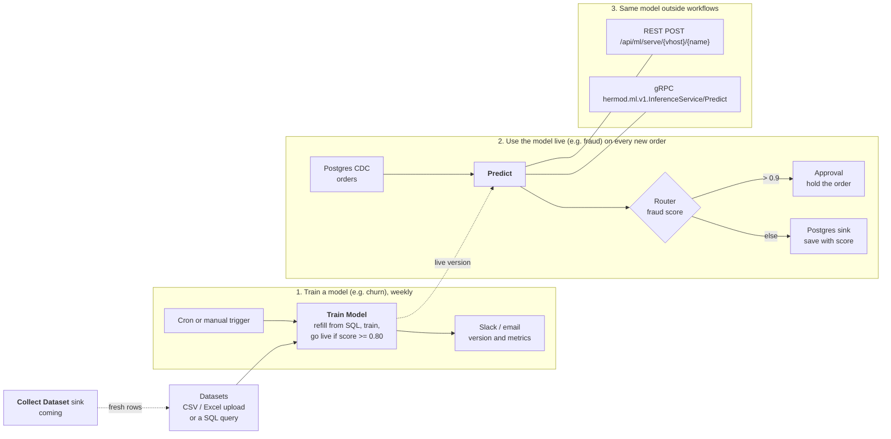

# Machine learning

Hermod trains machine-learning models on your data and calls them from
workflows and other applications. A model belongs to one vhost and is used
three ways: the **Predict** node in a workflow, the REST API, and gRPC.

A model is either **trained in Hermod**, on a dataset, by the `hermod-ml`
worker; or **served elsewhere** (KServe, Triton, MLServer, MLflow) and
registered by its address. Both are called the same way. Collecting training
data from a running workflow (the Collect Dataset sink) follows in a later
release; it is drawn dashed below.



## Train a model

Training runs in **hermod-ml**, a Python worker beside Hermod (scikit-learn,
XGBoost, exported to ONNX and served with ONNX Runtime; it never loads a
pickle). Run it and point Hermod at it:

| Setting | On | Meaning |
|---|---|---|
| `HERMOD_ML_WORKER_URL` | Hermod | The worker's address, e.g. `http://hermod-ml:8090`. Unset means training is off. |
| `HERMOD_ML_WORKER_TOKEN` | Hermod | Sent as a bearer token; must equal the worker's `HERMOD_ML_TOKEN`. |
| `HERMOD_ML_TRAIN_TIMEOUT` | Hermod | How long one training may take, default `30m`. |
| `HERMOD_ML_TOKEN` | worker | Required token. Without it the worker is open: never run it so outside a private network. |
| `HERMOD_ML_DATA_DIR` | worker | Datasets and model versions, default `/var/lib/hermod-ml`. Keep it on a volume. |
| `HERMOD_ML_MAX_TRAININGS` | worker | Trainings at once, default 1; another gets "busy". |

With Helm: `--set mlWorker.enabled=true --set mlWorker.token=…` (or
`mlWorker.existingSecret`). The chart refuses to run the worker without a token.

```bash
docker run -d --name hermod-ml -p 8090:8090 -e HERMOD_ML_TOKEN=change-me \
  -v hermod-ml:/var/lib/hermod-ml ghcr.io/gsoultan/hermod-ml:latest
```

### Datasets

On the **Models** page, under **Datasets**:

- **Upload a file**: CSV, or Excel `.xlsx` (first sheet, header row), up to 200 MB.
- **From a database**: a `SELECT` on one of the vhost's database sources
  (Postgres, MySQL/MariaDB, SQL Server, Oracle, SQLite, ClickHouse, DB2), run
  read-only with the source's own credentials, at most 1,000,000 rows unless you
  set another cap.

Filling a dataset again replaces its rows.

### Training

**Train a model** asks for a dataset, the column to predict, and optionally the
columns to learn from (empty means all the others). The task (classify, or
predict a number) is chosen from the target unless you pick it; the algorithm
is random forest unless you pick gradient boosting, linear/logistic regression
or XGBoost. A fifth of the rows are held back to score the model:

- classification: `accuracy`, `f1` (macro), `roc_auc` (two classes); `score` is accuracy
- numbers: `rmse`, `mae`, `r2`; `score` is R²

Every training makes a new, immutable version. Whether it goes live is your
rule: **only when I put it live**, **always**, or **if it scores at least** a
minimum on a metric. A version that is not put live is kept; **Versions** on
the model lists them all and puts any one live, which is also how you roll back.

### Train Model node

*Machine Learning → Train Model* does the same from a workflow: each message
that reaches it trains a new version, and the message carries the result under
`training` (version, metrics, `live`, and why). Optionally it first refills the
dataset from a database source with a query, so a weekly cron workflow keeps
the model fresh. Put it in a workflow that runs on a schedule or on demand,
not one that sees every change to a table.

A trained model is called like any other: the Predict node sends a record's
fields, one per feature, and gets back `label` and `probability` for a
classifier, or `value` for a number.

## Register a model served elsewhere

Open **Models** in the sidebar (Editor or Admin) and add a model:

| Field | Meaning |
|---|---|
| Name | How workflows and callers name it: letters, digits, `-`, `_`, `.` |
| Backend | `oip` for the Open Inference Protocol (KServe V2: KServe, Triton, Seldon MLServer, BentoML, TorchServe's V2 API) or `mlflow` for an MLflow scoring server (`/invocations`) |
| URL | The model server's base URL |
| Remote model / version | The model's name and version on that server (`oip` only) |
| Token secret | A vhost secret holding a bearer token for the server, if it needs one |
| Input name | Send every feature as one FP32 matrix tensor of this name (`oip` only). Empty sends one tensor per feature |
| Features | The features the model takes, in order. The Predict node offers a row for each |
| Timeout | Per call, default 30 s |

**Test** sends sample rows and shows the answer.

## Predict node

*Machine Learning → Predict.* Choose the model, map each feature to a record
field (or map nothing to send the whole record), and name the output field
(`prediction` by default). A model with one output writes the value; one with
several writes an object. A mapped field the record lacks fails the record
rather than sending a null; the node's On Error setting (fail, continue, drop)
decides what happens next.

## Serving to other applications

Serving is off until you make a serving key on the model (**Serving key →
Rotate**). The key is shown once; Hermod keeps only its SHA-256. Rotating
replaces it, and **Disable** removes it.

REST:

```bash
curl -X POST https://hermod.example.com/api/ml/serve/default/fraud \
  -H "X-API-Key: hml_…" \
  -d '{"instances": [{"amount": 912.5, "country": "ID"}]}'
# {"model":"fraud","predictions":[{"score":0.93}]}
```

`Authorization: Bearer hml_…` works too. A wrong key, a model without
serving, and a model that does not exist all answer the same 401.

gRPC (`pkg/ml/proto/inference.proto`), on Hermod's gRPC port with the key in
the `x-api-key` metadata:

```
hermod.ml.v1.InferenceService/Predict
  { vhost: "default", model: "fraud", instances: [{amount: 912.5, country: "ID"}] }
```

One call takes at most 1000 rows.

## Metrics

- `hermod_ml_predictions_total{vhost,model,outcome}`
- `hermod_ml_prediction_rows_total{vhost,model}`
- `hermod_ml_prediction_duration_seconds{vhost,model}`
