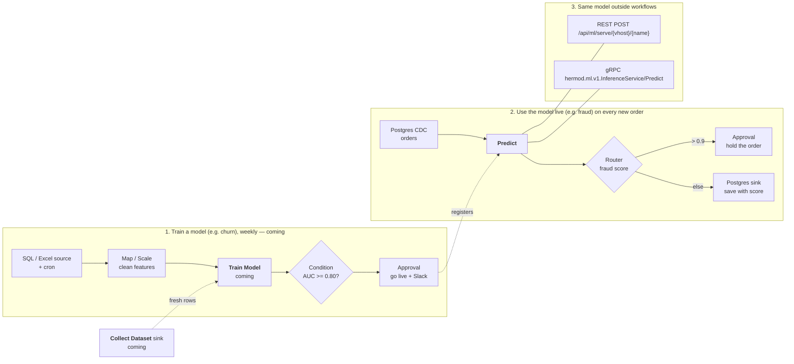

# Machine learning

Hermod calls machine-learning models from workflows and serves them to other
applications. A model is registered once per vhost and then used three ways:
the **Predict** node in a workflow, the REST API, and gRPC.

It also prepares the features a model takes: the *Feature Engineering* nodes
scale, encode and bucketize fields, and compute rolling features and anomaly
scores per key (see [Feature engineering nodes](#feature-engineering-nodes)).

This release covers *using* a model that a model server already runs. Training
models in Hermod (the Train Model node and the `hermod-ml` worker) and
collecting training data (the Collect Dataset sink) follow in later releases;
they are drawn dashed below.



## Register a model

Open **Models** in the sidebar (Editor or Admin) and add a model:

| Field | Meaning |
|---|---|
| Name | How workflows and callers name it: letters, digits, `-`, `_`, `.` |
| Backend | `oip` for the Open Inference Protocol (KServe V2: KServe, Triton, Seldon MLServer, BentoML, TorchServe's V2 API) or `mlflow` for an MLflow scoring server (`/invocations`) |
| URL | The model server's base URL |
| Remote model / version | The model's name and version on that server (`oip` only) |
| Token secret | A vhost secret holding a bearer token for the server, if it needs one |
| Input name | Send every feature as one FP32 matrix tensor of this name (`oip` only). Empty sends one tensor per feature |
| Features | The features the model takes, in order. The Predict node offers a row for each |
| Timeout | Per call, default 30 s |

**Test** sends sample rows and shows the answer.

## Predict node

*Machine Learning → Predict.* Choose the model, map each feature to a record
field (or map nothing to send the whole record), and name the output field
(`prediction` by default). A model with one output writes the value; one with
several writes an object. A mapped field the record lacks fails the record
rather than sending a null; the node's On Error setting (fail, continue, drop)
decides what happens next.

## Feature engineering nodes

*Feature Engineering* in the palette holds the preprocessing a model needs
between the source and **Predict**. Each writes new fields, named after the
field it reads unless you name a target. A field may be a path or an expression; an
expression needs a target field. **Missing or unusable value** decides what
happens to a record without the field, or with text where a number is needed:
fail it (the default — the node's On Error setting then applies) or leave the
record unchanged.

The same preprocessing has to run at training and at inference, or the model
is served numbers on a different scale from the ones it learned. So **Scale**,
**Encode** and **Bucketize** never learn from the records they see: what they
apply is typed into the node once, from the training run, and every record is
transformed the same way.

### Scale

Min-max — `(v − min) / (max − min)` — or z-score — `(v − mean) / std` — per
field, with the statistics given in the node. Each field row takes its own
numbers, or leaves them blank to take them from **Fitted stats**, a JSON object
pasted from training:

```json
{"amount": {"mean": 120.5, "std": 40.2}, "age": {"min": 18, "max": 90}}
```

With no field rows, every field in the pasted stats is scaled. Output goes to
`<field>_scaled` unless a row names a target. **Clip** keeps min-max output in
[0, 1]; without it a value outside the training range scales past either end,
as it would have in training. A `max` not above `min`, or a `std` of 0,
fails every record with the reason, since it cannot scale anything.

### Encode

- **One-hot** — one 0/1 field per category in the list, named
  `<prefix><category>` (prefix `<field>_` by default), plus `<prefix>other` for
  a value not in the list. Turn the other bucket off to write all zeros
  instead.
- **Label** — a JSON mapping of category to integer, e.g. `{"S":0,"M":1,"L":2}`,
  written to `<field>_label`. An unknown category gets **Unknown value** (-1 by
  default), or fails the record.
- **Hash** — FNV-1a (32-bit) of the value, modulo **Buckets**, written to
  `<field>_bucket`. It needs no vocabulary and gives the same bucket on every
  run and version, so a model trained on it can be served by it.

A value is matched in its text form: the number `2` matches the category `"2"`.

### Bucketize

**Edges** e0, e1, …, en make n bins: [e0, e1), [e1, e2), …, [e(n−1), en]. Each
bin holds its lower edge; the last also holds en. With **Labels** (one per bin)
the label is written to `<field>_bin`, otherwise the bin's number from 0. A
value outside the edges writes null by default, or goes to the first or last
bin (**clip**), or fails the record.

### Rolling Features

Count, sum, mean, std (population), min and max of a field over each key's
recent records, written to `<prefix><feature>` — `amount_mean` with the default
prefix `<field>_`. **Key by** names the key, e.g. `customer_id`; without it there
is one window for every record. The window is either the last N records of the
key or the records of a time span (`5m`, `1h`) — at most **Max events per key**
of them, 1000 by default. The window includes the record being processed. Time
is processing time: when the record reached the node. Without a field the node
only counts records.

Memory is bounded: a node holds at most **Keys kept in memory** keys (10 000 by
default), dropping the key seen least recently, and each key holds at most its
window. Records of one key are applied one at a time, in the order they reach
the node, so parallel workers do not lose an update.

### Anomaly Score

Scores a field against the same kind of per-key window, then adds the record to
it:

- **Z-score** — `|v − mean| / std` of the window before the record. Default
  threshold 3.
- **IQR** — how many interquartile ranges `v` lies below Q1 or above Q3 (0
  between them). Quartiles interpolate linearly, as numpy's default does.
  Default threshold 1.5, Tukey's fences.

The score goes to `<field>_anomaly_score` and `score > threshold` to
`<field>_is_anomaly`. A key with less than **Minimum history** (10 by default,
or the window size if smaller) gets a null score and `false`. A history with no
spread — every value equal — scores an equal value 0 and flags any other with a
null score, since no finite score exists.

### What survives a restart

Rolling Features and Anomaly Score keep their windows the way Aggregate keeps
its totals:

- **By default** windows live in the worker's memory only. A restart, the
  workflow moving to another worker, or a key dropped from memory starts that
  key's window empty: its next records get features from less history.
- **Keep windows across restarts** also saves a key's window to the engine's
  state store after every record and reads it back when the key is next seen —
  after a restart, or after the key was dropped from memory. A time window read
  back drops what expired meanwhile. Failing to save does not fail the record;
  it is logged, and that key's saved window stays stale until the next save.

Either way, a record redelivered after a crash is counted again, and changing
the field or the window starts every key afresh.

## Serving to other applications

Serving is off until you make a serving key on the model (**Serving key →
Rotate**). The key is shown once; Hermod keeps only its SHA-256. Rotating
replaces it, and **Disable** removes it.

REST:

```bash
curl -X POST https://hermod.example.com/api/ml/serve/default/fraud \
  -H "X-API-Key: hml_…" \
  -d '{"instances": [{"amount": 912.5, "country": "ID"}]}'
# {"model":"fraud","predictions":[{"score":0.93}]}
```

`Authorization: Bearer hml_…` works too. A wrong key, a model without
serving, and a model that does not exist all answer the same 401.

gRPC (`pkg/ml/proto/inference.proto`), on Hermod's gRPC port with the key in
the `x-api-key` metadata:

```
hermod.ml.v1.InferenceService/Predict
  { vhost: "default", model: "fraud", instances: [{amount: 912.5, country: "ID"}] }
```

One call takes at most 1000 rows.

## Metrics

- `hermod_ml_predictions_total{vhost,model,outcome}`
- `hermod_ml_prediction_rows_total{vhost,model}`
- `hermod_ml_prediction_duration_seconds{vhost,model}`
