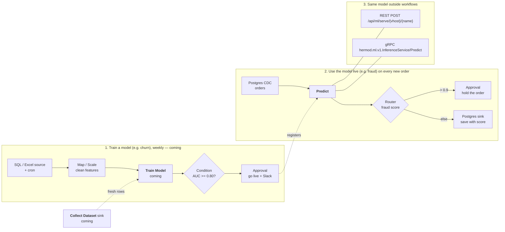

# Machine learning

Hermod calls machine-learning models from workflows and serves them to other
applications. A model is registered once per vhost and then used three ways:
the **Predict** node in a workflow, the REST API, and gRPC.

This release covers *using* a model that a model server already runs. Training
models in Hermod (the Train Model node and the `hermod-ml` worker) and
collecting training data (the Collect Dataset sink) follow in later releases;
they are drawn dashed below.



## Register a model

Open **Models** in the sidebar (Editor or Admin) and add a model:

| Field | Meaning |
|---|---|
| Name | How workflows and callers name it: letters, digits, `-`, `_`, `.` |
| Backend | `oip` for the Open Inference Protocol (KServe V2: KServe, Triton, Seldon MLServer, BentoML, TorchServe's V2 API) or `mlflow` for an MLflow scoring server (`/invocations`) |
| URL | The model server's base URL |
| Remote model / version | The model's name and version on that server (`oip` only) |
| Token secret | A vhost secret holding a bearer token for the server, if it needs one |
| Input name | Send every feature as one FP32 matrix tensor of this name (`oip` only). Empty sends one tensor per feature |
| Features | The features the model takes, in order. The Predict node offers a row for each |
| Timeout | Per call, default 30 s |

**Test** sends sample rows and shows the answer.

## Predict node

*Machine Learning → Predict.* Choose the model, map each feature to a record
field (or map nothing to send the whole record), and name the output field
(`prediction` by default). A model with one output writes the value; one with
several writes an object. A mapped field the record lacks fails the record
rather than sending a null; the node's On Error setting (fail, continue, drop)
decides what happens next.

## Serving to other applications

Serving is off until you make a serving key on the model (**Serving key →
Rotate**). The key is shown once; Hermod keeps only its SHA-256. Rotating
replaces it, and **Disable** removes it.

REST:

```bash
curl -X POST https://hermod.example.com/api/ml/serve/default/fraud \
  -H "X-API-Key: hml_…" \
  -d '{"instances": [{"amount": 912.5, "country": "ID"}]}'
# {"model":"fraud","predictions":[{"score":0.93}]}
```

`Authorization: Bearer hml_…` works too. A wrong key, a model without
serving, and a model that does not exist all answer the same 401.

gRPC (`pkg/ml/proto/inference.proto`), on Hermod's gRPC port with the key in
the `x-api-key` metadata:

```
hermod.ml.v1.InferenceService/Predict
  { vhost: "default", model: "fraud", instances: [{amount: 912.5, country: "ID"}] }
```

One call takes at most 1000 rows.

## Metrics

- `hermod_ml_predictions_total{vhost,model,outcome}`
- `hermod_ml_prediction_rows_total{vhost,model}`
- `hermod_ml_prediction_duration_seconds{vhost,model}`
